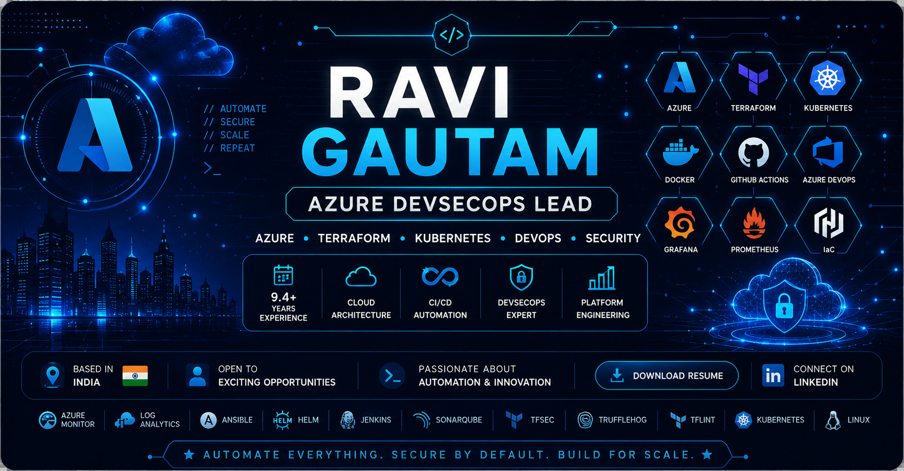

  

<!-- 

  

 -->

# 👋 Hi, I'm Ravi Gautam

### 🚀 Azure DevSecOps Lead | AI Engineering Enthusiast | Exploring AIOps, MLOps & Generative AI

 

# 💎 About Me

I'm an **Azure DevSecOps Lead** with **9.4+ years of IT experience**, specializing in designing **secure, scalable, and automated cloud platforms on Microsoft Azure**.

I enjoy building **production-grade CI/CD pipelines, Infrastructure as Code, Kubernetes platforms, DevSecOps automation, cloud governance, enterprise landing zones, and zero-public-exposure architectures**.

---

  

  

# 🚀 Core Expertise

- ☁️ Enterprise Azure Landing Zone (CAF)
- 🏗 Terraform Modular Infrastructure
- ⚙️ Azure DevOps & GitHub Actions
- ☸️ AKS & Container Platforms
- 🔐 DevSecOps & Cloud Security
- 🛡 Azure Governance & Policy
- 🌐 Hub-Spoke Networking
- 📊 Observability & Monitoring
- ♻️ Disaster Recovery & Business Continuity
- 🤖 Infrastructure Automation

  

## 🌱 Currently Exploring

  

  
- 🤖 AIOps for intelligent DevOps automation
- 🧠 MLOps workflows and ML platform engineering
- 🦙 Large Language Models (LLMs)
- 🔗 Model Context Protocol (MCP)
- 📚 Retrieval Augmented Generation (RAG)
- ☁️ AI-driven Cloud Operations

# 🎯 Professional Highlights

- 🏢 **Azure DevSecOps Lead**
- ⏳ **9.4+ Years of IT Experience**
- ☁️ Microsoft Azure Specialist
- 🏗 Terraform Enterprise Architectures
- 🔐 Secure CI/CD & DevSecOps Automation
- 🌐 Hub-Spoke & Zero Public Exposure Designs
- 📊 Enterprise Monitoring & Observability
- ♻️ Disaster Recovery & High Availability Planning

# 📫 Connect With Me

- 📧 **Email:** raviniit68440@gmail.com
- 💼 **LinkedIn:** https://www.linkedin.com/in/ravi-gautam-0440243aa
- 🐙 **GitHub:** https://github.com/raviniit68440
- 🌐 **Portfolio:** Coming Soon 🚧

### ⭐ "Automate Everything. Secure by Default. Build for Scale." ⭐

